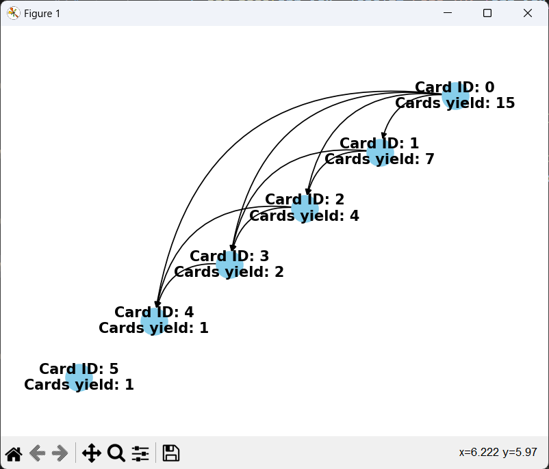

## Visualization of the problem


# ScratchCards Class

This class represents a set of scratch cards, allowing parsing of card data, calculation of points, visualization of card solutions, and retrieval of card-related information.

### Attributes

- `cards`: A list containing tuples of winning number sets and player number sets.
- `total_score`: An integer representing the total score accumulated from scratch card matches.

### Methods

#### `parse(self, lines: str) -> None`

Parses the input string containing scratch card data and populates the `cards` attribute.

- **Parameters:**
  - `lines` (str): A string containing card information in the format: "info: numbers".
  
- **Usage Example:**
  ```python
  scratch = ScratchCards()
  data = "info: 1 2 3|2 4 6\ninfo: 2 4 6|1 3 5"
  scratch.parse(data)

#### `get_plot(self) -> None`

Generates and displays a graph visualizing the solution sequence of scratch cards using networkx and matplotlib.

- **Usage Example:**
  ```python
  scratch = ScratchCards()
  # ... (populate cards)
  scratch.get_plot()

#### `get_cards(self) -> int`

Calculates and returns the total number of cards from the scratch card games using a dynamic programming approach.

- **Returns:**
  - `int`: Total number of cards.

- **Usage Example:**
  ```python
  scratch = ScratchCards()
  # ... (populate cards)
  total_cards = scratch.get_cards()


### Purpose

The `ScratchCards` class provides functionalities to handle and analyze scratch card games, including parsing card data, calculating scores, visualizing solutions, and retrieving specific card information.

### Notes for Users

- Use the `parse` method to input card data in the specified format.
- Visualize the solution sequence of cards using `get_plot`.
- Retrieve the total number of cards using `get_cards`.
- Access individual card sets using `_win_set` and `_my_set`.
- Ensure the input data format matches the expected structure for proper parsing and analysis.
